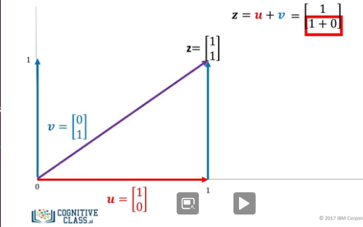
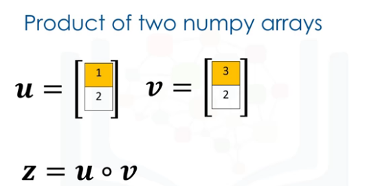
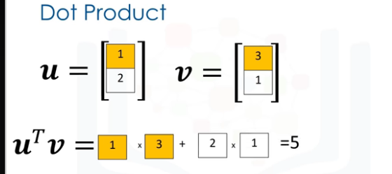
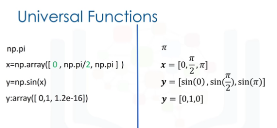

# python_pure_concepts

### Different between append and extend in list is that by extend you can add multiple items but by append you can add just one
```
list = [1,2,3]
list.append([2,5])
  res = [1,2,3,[2,5]]
list.extend([2,5])
  res = [1,2,3,2,5]
```

### list methods
```
list = [1,2,3]
del(a[0])
```

## Immutable and mutable
### list is mutable and tuple is immutable the following id is id refrenced in ram
```
 list = [1,2,3]
 id(list)
140674943444104
 list.append(4)
 id(list)
140674943444104 
 tuple = (1,3,4)
 id(tuple)
140674943235848
 tuple = tuple + (2,)
 id(tuple)
140674943825304
```
It means you can do these:
```
 list = [1,3,4]
 list2 = list
 list.extend([5,6,7])
 list
[1, 3, 4, 5, 6, 7]
 list2
[1, 3, 4, 5, 6, 7] 

 list = [1,3,4]
 list2 = list[:]
 list2
[1, 3, 4]
 list.append(45)
 list2
[1, 3, 4] 
```

# Sets
Sets are a type of collection. This means that like lists and tuples, you
can input different python types. 
Unlike lists and tuples they are unordered.This means sets do not record element position. 
Sets only have unique elements. This means there is only one of a particular element in a set.
```
 set1 = {"a", "a", "b", "c"}
 set1
{'a', 'c', 'b'}
 set1 = {"a":"12", "a" : "45", "b": "56", "c": "98"}
 set1
{'a': '45', 'b': '56', 'c': '98'}
 set1 = {"a":"12", "a" : "45", "b": "56", "c": "98"}
 set1
{'a': '45', 'b': '56', 'c': '98'}

 list = [1,2,4,"tiger","tiger", "tylor"]
 set(list)
{1, 2, 4, 'tylor', 'tiger'}
 
 
 set2 = {"a","b","c","d","e"}
 set2.add("f")
 set2
{'f', 'e', 'b', 'a', 'd', 'c'}
 set2.add("f")
 set2
{'f', 'e', 'b', 'a', 'd', 'c'}
 set2.remove("f")
 {'e', 'b', 'a', 'd', 'c'}
 
'a' in set2
True


----- & ----

 set1 = {"a","b","c","d","e"}
 set2 = {"a", "b", "name"}
 set3 = set1 & set2
 set3
{'a', 'b'}

----- union ----
set1.union(set2)
{'d', 'c', 'e', 'b', 'a', 'name'}

---- issubset ----
 set1 = {1,2,3}
 set2 = {1,2,3,4}
 set1.issubset(set1)

set1.symmetric_difference(set2)
{4}

```
# Dictionaries
The keys have to be immutable and unique
The values can be immutable, mutable and and duplicates
```
dict = {"a" : "b", "1" : 2}
 dict
{'a': 'b', '1': 2}
 dict["1"]
2
 dict["a"]
 dict["a"] = "new_value"
 del(dict["a"])
 
 "a" in dict
 False
 
 dict.keys()
 dict.values()
 
 dict.get("a")
 res --> "b"
 
 dict.get("c", None)
 res --> None
 
 dict.get("c", "X")
 res --> "X"
 
```

# Functions
```
def ArtistNames(*names):
    print(names)
    
ArtistNames("Hassan", "Ali", "Mohsen")
```
### Global Scope
```
x is global variable
ArtistNames(x):
    return x + " ghaffari"

x="mohamad"
ArtistNames(x):
print(x):
    "mohamad ghaffari"
```
### Set variable global in function
```
def pinkfloyd():
    global ClaimedSales
    ClaimedSales = "45 million"
    return ClaimedSales

pinkfloyd()
print(ClaimedSales)
"45 million"
```

# Objects and Classes
### Function init is a constructor
```
class Circle(object):

    def __init__(self, radius, color):
      # Attributes
      self.radius = radius
      self.color = color


class Rectangle(object):

    def __init__(self, height, width, color):
      # Attributes
      self.height = height
      self.width = width
      self.color = color
   
Now we can have several ojects of any class

C1 = Circle(10, "red")
C2 = Circle(0.001, "Pink")
C1.color = "Blue"
C2.radius = 1


Class methods:

class Circle(object):

    def __init__(self, radius, color):
        # Attributes
        self.radius = radius
        self.color = color
      
    def add_radius(self,r):
        self.radius = self.radius + r

Default value in constructor:
def __init__(self, radius=10, color='red'):

dir(NmaeOfObject)
dir() method is useful for obtaining the list of data attributes and methods associated
dir(Circle)
```

# Reading file with open
```
file1 = open("/resources/data/example.txt", "w")
file1.close

with open(""/resources/data/example.txt"", "w") as f:
    file_read = f.read()

print(f.closed()) ---> True
print(file_read) ---> You can't access to file_read out of with indention

with open is better practice because it automaticlly closes the file

To append to a file use this:
with open("Example3.txt","a") as file1:
    file1.write("This is line C\n")
```

# Writing file with opne
```
with open(""/resources/data/example.txt"", "w") as f:
    file_read = f.write("New Line")
```

# Pandas
```
import pandas as pd

----CSV----
df = pd.read_csv("SLA_SEC_4G_A7.csv")
print(df.head()) ----> First five line

----XLSX----
df = pd.read_csv("SLA_SEC_4G_A7.xlsx")
print(df.head()) ----> First five line


print(df[["VOLTE_CDR"]]) ---> Just a column
print(df[["VOLTE_CDR","PAGING_DELETATION_RATE"]]) ---> some of columns
print(df.iloc[0,0]) ---> first row and first column
print(df.iloc[1,0]) ---> second row and first column
print(df.iloc[0,2])
print(df.loc[0,"PAGING_DELETATION_RATE"])
print(df.loc[0,"VOLTE_CDR"])
print(df.loc[1,"PAGING_DELETATION_RATE"])
print(df.loc[1,"VOLTE_CDR"])
print(df.loc[0:2, 0:3]) ----> First two rows and three columns
print(df.loc[0:2,'VOLTE_CDR':'PAGING_DELETATION_RATE']) ----> First two rows columns between 'VOLTE_CDR' and 'PAGING_DELETATION_RATE'


df is data frame that is comprised of rows and columns,
We can create a data frame out of a dictionary

dict = {"a":[1,2,3,4,5],
        "b":[6,7,8,9,0],
        "c":["a","b","c","d","e"]}
        

df = pd.DataFrame(dict)
print(df[["a"]]) ---> Just a column
print(df[["a","b"]]) ---> some of columns

df["VOLTE_CDR"].unique()

df = pd.read_csv("SLA_SEC_4G_A7.csv")
print(df["VOLTE_CDR"].unique())
list = df["VOLTE_CDR"].unique()
for item in list:
    #print(item)
    pass

list = df["VOLTE_CDR"] >= 0.3582
for item in list:
    #print(item)
    pass

print(df["VOLTE_CDR"] >= 0.3582) ---> res is true and false
print(df[df["VOLTE_CDR"] >= 0.3582]) ---> res is all columns and rows values with this condition" >= 0.3582 "
df1 = df[df["VOLTE_CDR"] >= 0.3582]

We can save new DataFrame with df1.to_csv('new_values.csv')

```
# Simple APIs
```
import pandas as pd
from nba_api.stats.static import teams

Add api result to a DataFrame type

nba_teams = teams.get_teams()
keys = nba_teams[0].keys()
one_dict = {key:[] for key in keys}

for item in nba_teams:
    for key, value in item.items():
        one_dict[key].append(value)

df_teams = pd.DataFrame(one_dict)
#print(df_teams)

df_warriors = df_teams[df_teams['state'] == 'New York']
print(df_warriors)

How to access ir id's of df result:

warriors_id = df_warriors[["id"]].values res ----> [[1610612751] [1610612752]]


from nba_api.stats.endpoints import leaguegamefinder

gamefinder = leaguegamefinder.LeagueGameFinder(team_id_nullable=warriors_id)
games = gamefinder.get_data_frames()[0]
print(games.head())

games_home = games[games['MATCHUP'] == 'BKN @ HOU']
games_away = games[games['MATCHUP'] =='BKN vs. DAL']
print(games_home.head())
print(games_away.head())

```

# 1D Numpy
## Numpy is a library for scientific computing. It has many useful functions. There are many other advantages 
## like speed an memory. Numpy is also the basis for pandas,.
```
A "numpy" array or "ndarray" is similar to a list. It's usually fixed in size and each
element is of the same type, in this case, integers. We can cast a list to a numpy array
[0,1,2,3,4]

ndim:
represents the number of array dimensions or the rank of the array, in this case one.
shape:
The attribute "shape” is a tuple of integers indicating the size of the array in each dimension.

a = np.array([0,1,2,3,4])
print(a[0],a[3])
print(a,"@@", type(a),"@@", a.dtype, "@@",a.size,"@@",a.ndim,"@@","@@",)

# Change the values
a[0] = 50
print(a)

Change two number:
d[1:3] = -1,-2

Vector
Vector addition is a widely used operation in data science. Consider the vector 'u' with

```


```
u=[1,0]
v=[0,1]
z=[]
for m,n in zip(u,v):
    z.append(m+n)
z = [1,1]
    
But it's easy in numpy:
u = np.arary([1,0])
v = np.arary([0,1])
z = u+v
==> [1,1]
z = u-v
==> [1,-1]
```
Array multiplication with a Scalar


```
y=np.array([1,2])
z = 2*y
==> [2,4]

but if
y  [1,2]
2*z
[1, 2, 1, 2]

y = [1,2]
z=[]
for n in y:
    z.append(2*n)
z = [2,4

```
Product of two numpy array



```
u = np.array([1,2])
v = np.array([3,2])
z = u*v
==> [3,4]
```
Dot Product



```
u = np.array([1,2])
v = np.array([3,1])
result = np.dot(u,v)
==> 5

Adding Constant to an numpy arrey
u = np.array([1,2,3,-1])
z = u+1
z:array([2,3,4,0])
```
Universal Functions
```
u = np.array([1,2,3,-1])
mean_a = a.mean()
1/4*(1+2+3-2)
==> 1
And ther are many other functions
max_a = a.max()
np.pi ==> pi in mathmathic
x = np.array([0, np.pi/2, np.pi])
y = np.sin(x)
```
np.pi

